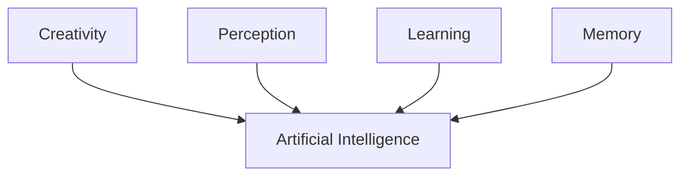

Theoretical AI research that attempts to create something with human-like intelligence and the ability to self-teach.

The main underlying idea is to have a self-extensible system that is able to perform tasks dissimilar to what it was originally trained to perform/do.

Current versions of AI (Winter 2025) are examples of [[Weak AI]]. 

[[Strong AI]] is full AGI, capable of performing tasks at a human-level with little background/context. 

AGI Requires a lot more than what we are delivering today (Winter 2025)

### Theoretical approaches to AGI
#TODO <-- need to come back to this later

Stuff online: [What is AGI - amazon.com](https://aws.amazon.com/what-is/artificial-general-intelligence/)

> ## What are the theoretical approaches to artificial general intelligence research?
> 
> Achieving AGI requires a broader spectrum of technologies, data, and interconnectivity than what powers AI models today. Creativity, perception, learning, and memory are essential to create AI that mimics complex human behavior. AI experts have proposed several methods to drive AGI research. 
> 
> ### **Symbolic**
> 
> The symbolic approach assumes that computer systems can develop AGI by representing human thoughts with expanding logic networks. The logic network symbolizes physical objects with an if-else logic, allowing the AI system to interpret ideas at a higher thinking level. However, symbolic representation cannot replicate subtle cognitive abilities at the lower level, such as perception.
> 
> ### **Connectionist**
> 
> The connectionist (or emergentist) approach focuses on replicating the human brain structure with neural-network architecture. Brain neurons can alter their transmission paths as humans interact with external stimuli. Scientists hope AI models adopting this sub-symbolic approach can replicate human-like intelligence and demonstrate low-level cognitive capabilities. Large language models are an example of AI that uses the connectionist method to understand natural languages. 
> 
> ### **Universalists**
> 
> Researchers taking the universalist approach focus on addressing the AGI complexities at the calculation level. They attempt to formulate theoretical solutions that they can repurpose into practical AGI systems. 
> 
> ### **Whole organism architecture**
> 
> The whole organism architecture approach involves integrating AI models with a physical representation of the human body. Scientists supporting this theory believe AGI is only achievable when the system learns from physical interactions. 
> 
> ### **Hybrid**
> 
> The hybrid approach studies symbolic and sub-symbolic methods of representing human thoughts to achieve results beyond a single approach. AI researchers may attempt to assimilate different known principles and methods to develop AGI.