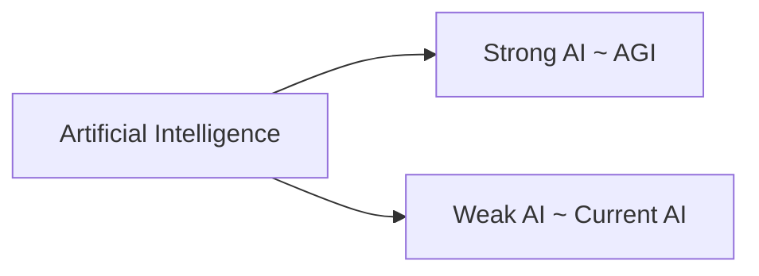

---
tags:
  - TODO
aliases:
  - AI
---
There are many ways to divide and break down [[Artificial Intelligence|AI]]. 
One approach is based on "general ability" which leads to the following categories:
- [[Strong AI]]
- [[Weak AI]]

Software it _deterministic_ but AI models are _probabilistic_
