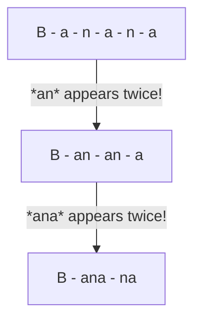

> A way to break down words into common pieces by sticking together pairs that appear a lot

> Which letters tend to be together a lot?

Start with letters --> stick together pairs that appear a lot --> make word pieces

### Example: Banana

