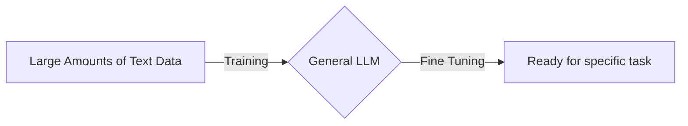

---
aliases:
  - LLM
---
# Technical know-how

### Steps
1. Before a neural network can process text it must undergo [[Tokenization|tokenization]]
2. Next, LLMs must undergo [[Pretraining|pretraining]]
# General Understanding

An LLM is a type of [[Artificial Intelligence|AI]] that recognizes and generates text.

The "Large" part comes from the fact that it is trained on a vast amount of data.

LLMs are built upon [[Machine Learning|ML]], more specifically, a type of [[Neural Network]] called a [[Transformer]]

LLMs utilize a subset of [[Machine Learning|ML]] called [[Deep Learning]] that allows us to understand how words, character, and sentences function together.

A key use for LLMs is their capability within the context of [[Generative AI|GenAI]]
#### Uses of LLMs
- [[Sentiment Analysis]]
- DNA Research
- Customer Service
- [[Chatbot|Chatbots]]
- Online Search
### Advantages
- Ability to respond to unpredictable input syntax
	- Traditional - Fixed programming (computer programs) have a set of expected inputs and a defined set-of mapped outputs

### Disadvantages
- *HEAVILY* reliant on the quality of inputs
	- Bad Inputs (false info sneaks in) --> Bad Outputs (false info given by LLM)
- LLMS also have the tendency to [[LLM Hallucination |hallucinate]]

### Security Problems
- User-facing LLMs:
	- LLMs are not secure data banks - uploading user data for increased productivity runs the risk of private/confidential data being used for retraining models
		- Private data can be used as a response for another use query

### LLM Security
[Securing LLMs](https://www.cloudflare.com/the-net/vulnerable-llm-ai/) #TODO 

Software it _deterministic_ but LLMs are _probabilistic_