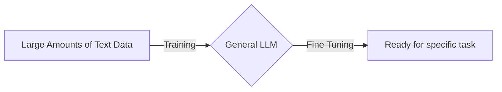

---
aliases:
  - LLM
---
An LLM is a type of [[Artificial Intelligence|AI]] that recognizes and generates text.

The "Large" part comes from the fact that it is trained on a vast amount of data.

LLMs are built upon [[Machine Learning|ML]], more specifically, a type of [[Neural Network]] called a [[Transformer]]

LLMs utilize a subset of [[Machine Learning|ML]] called [[Deep Learning]] that allows us to understand how words, character, and sentences function together.

A key use for LLMs is their capability within the context of [[Generative AI|GenAI]]
#### Uses of LLMs
- [[Sentiment Analysis]]
- DNA Research
- Customer Service
- [[Chatbot|Chatbots]]
- Online Search