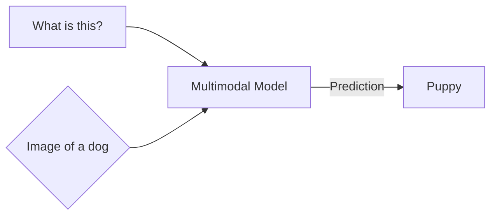

---
aliases:
  - LMM
  - LMMs
  - Multimodal Model
---
> A model that can learn/work with 2 or more data modalities

> A model that can understand/generate multiple types of data

E.g. Multimodal model example

