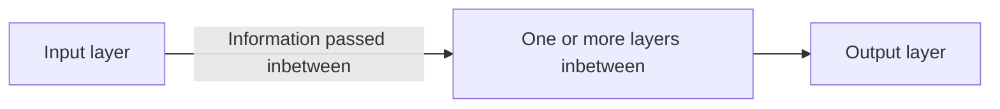

---
tags:
---
> Neural Networks model the human brain

In the same way we have neurons, Neural Networks have [[Network nodes|network nodes]] as well

[[Network nodes]] connect to each other pass information through "layers"

#### Layers

Input Layer: Data Enters the system
Hidden Layers (Layers in between): These create understanding of patterns in the system
- Hidden layers apply [[Weights]] to the input data and pass it through an [[Activation Function]]
Output Layer: Produces the final result
- The outputs in this stage are typically referred to as [[Logits]] which are raw scores that are then transformed into probabilities

#### Training Process
Training a neural network involves the loop of the following to find the optimal parameters for getting the best desired output:
1. [[Forward Pass]] --> Makes a guess with what I have
2. [[Loss Function]] --> How wrong was I?
3. [[Backpropagation]] --> What caused me to make a wrong guess, can I adjust that?
4. [[Gradient Descent]] --> Applying the fix

By repeating this process over many [[Epochs|epochs]], the model "learns" to make better predictions