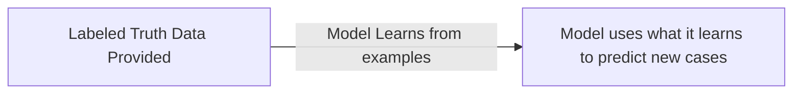

> Giving a model feedback about how it is performing

> The process of training a Machine Learning algorithm using labeled data

Getting data to supervise the model can be slow and expensive.

Supervision Example:

### Types
- [[Self-supervised Learning]]
	- Overcomes the bottleneck of slow and expensive data labeling.